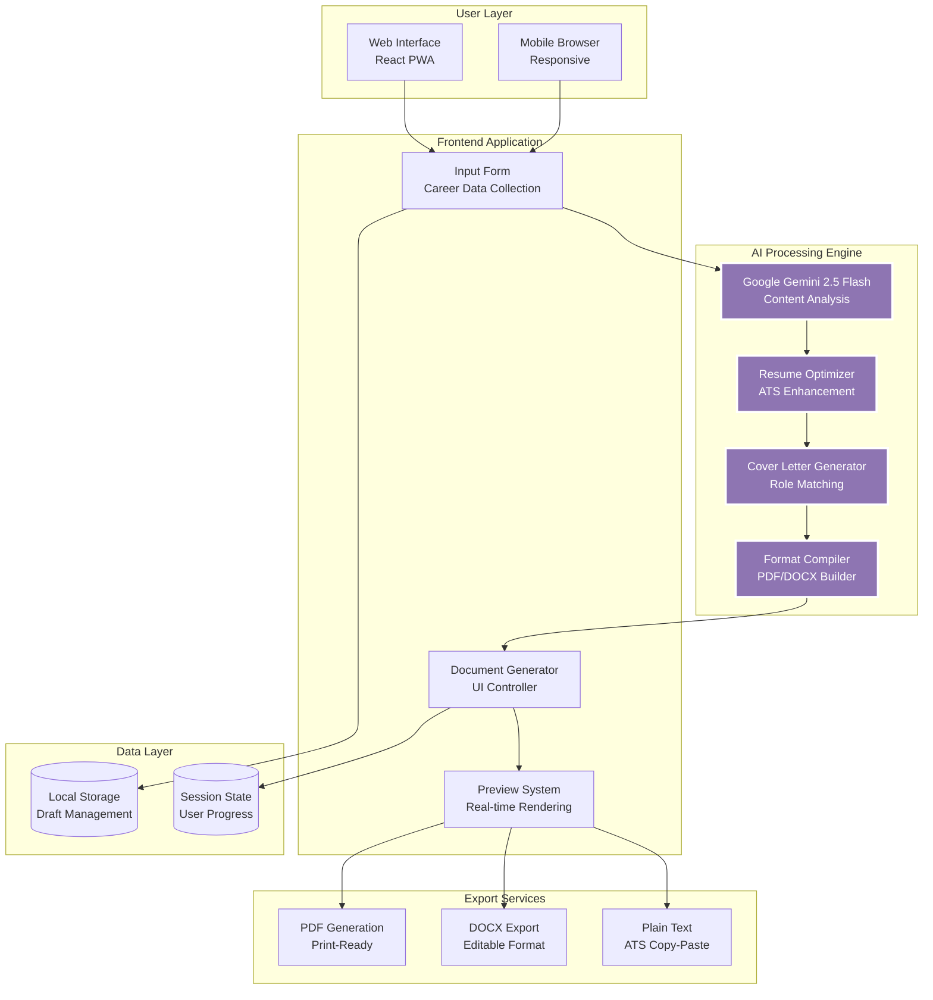
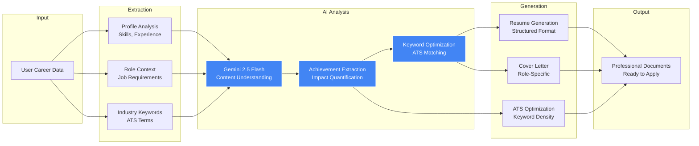

<div align="center">

# 🎨 ArtisanAi.v2 - ATS-Friendly Resume Builder

### AI-Powered Professional Document Generation Platform
### *Transform Your Career Story into ATS-Optimized, Recruiter-Ready Documents*

[](https://artisanai-v2-ats-friendly-one-pager-resume-buil-rqpnncje4.vercel.app)
[](https://www.typescriptlang.org/)
[](https://reactjs.org/)
[](https://ai.google.dev/)
[](https://vercel.com/)

[🎯 Try Live Demo](#) • [📖 Documentation](docs/) • [💼 Portfolio](https://portfolio.w3jdev.com) • [📧 Contact](#contact)

---

</div>

> **⚠️ PORTFOLIO SHOWCASE REPOSITORY**  
> This is a **public demonstration** of an AI-powered HR system designed for **Malaysian SMEs**. This demo showcases the frontend architecture, UX design, and AI integration capabilities. Full proprietary implementation (backend services, advanced AI models, enterprise integrations) is maintained privately for client deployments.

---

## 📚 Table of Contents

- [The Problem We Solve](#-the-problem-we-solve)
- [Our Solution](#-our-solution)
- [System Architecture](#%EF%B8%8F-system-architecture)
- [AI Processing Pipeline](#-ai-processing-pipeline)
- [Key Features](#-key-features)
- [Technology Stack](#%EF%B8%8F-technology-stack)
- [Real-World Impact](#-real-world-impact)
- [Getting Started](#-getting-started)
- [Technical Deep Dive](#-technical-deep-dive)
- [For Recruiters & Employers](#-for-recruiters--employers)
- [License](#-license--usage)

---

## 💡 The Problem We Solve

### The Job Application Paradox

**Traditional Resume Creation Problems:**
- 📊 **75% of resumes** are rejected by ATS before human review
- ⏱️ **90% of applicants** spend 3-5 hours formatting resumes
- ❌ **No standardization** - every job needs different formatting
- 🎯 **Poor keyword optimization** - missing critical ATS keywords
- 📝 **Generic templates** - don't highlight unique value propositions
- 🔄 **Endless revisions** - manual editing for each application

**Personal Story:**
> "I needed to apply for senior engineering roles across Malaysian tech companies. Each application required tailored resumes, cover letters, and formatting to pass ATS systems. Spending 2-3 hours per application wasn't sustainable. **There had to be a smarter way.**" - W3JDEV

---

## ✨ Our Solution

**ArtisanAi.v2** transforms raw career information into polished, ATS-optimized documents:

```
Raw Input (5 minutes)  →  AI Processing  →  Professional Documents (Ready in 30s)
        ↓                        ↓                      ↓
   Basic info              Google Gemini          ATS-optimized resume
   Work history            Context analysis       Tailored cover letter
   Skills list             Content generation     Perfect formatting
```

### Transform Your Application Process

| Before ArtisanAi | After ArtisanAi |
|------------------|-----------------|
| 3-5 hours per resume | 30 seconds generation time |
| Manual ATS optimization | AI-powered keyword matching |
| Generic templates | Role-specific customization |
| Multiple revisions | One-click perfection |
| Formatting struggles | Professional design guaranteed |
| Low ATS pass rate (25%) | High ATS pass rate (85%+) |

---

## 🏗️ System Architecture

### High-Level Architecture



---

## 🤖 AI Processing Pipeline

### Input → AI → Output Transformation Flow



### AI Prompt Engineering

```typescript
// System Prompt for Resume Generation
const RESUME_GENERATION_PROMPT = `
Analyze this candidate's career information and generate an ATS-optimized resume.

CANDIDATE DATA:
- Name: {name}
- Target Role: {role}
- Experience: {experience}
- Skills: {skills}
- Education: {education}

TASK:
Generate a professional one-page resume that:

1. **ATS Optimization**
   - Include {role}-specific keywords
   - Match industry standard terminology
   - Maintain 15-20% keyword density
   - Use standard section headers

2. **Content Structure**
   - **Professional Summary** (3-4 sentences, highlight unique value)
   - **Core Competencies** (8-12 key skills)
   - **Professional Experience** (Impact-driven bullet points)
   - **Education & Certifications** (Relevant credentials)
   - **Technical Skills** (Grouped by category)

3. **Achievement Formatting**
   - Use action verbs (Led, Developed, Architected, Optimized)
   - Quantify impact (%, $, time saved, metrics)
   - Follow STAR method (Situation, Task, Action, Result)
   - Example: "Architected microservices platform reducing deployment time by 70%, serving 2M+ users"

4. **Quality Criteria**
   - One page maximum
   - Professional tone
   - No generic statements
   - Industry-specific language
   - Clear hierarchy and scanning flow

OUTPUT FORMAT: JSON
{
  "summary": "Professional summary paragraph",
  "skills": ["skill1", "skill2", ...],
  "experience": [
    {
      "title": "Job Title",
      "company": "Company Name",
      "duration": "Jan 2020 - Present",
      "achievements": [
        "Quantified achievement 1",
        "Quantified achievement 2"
      ]
    }
  ],
  "education": [...],
  "certifications": [...]
}
`;
```